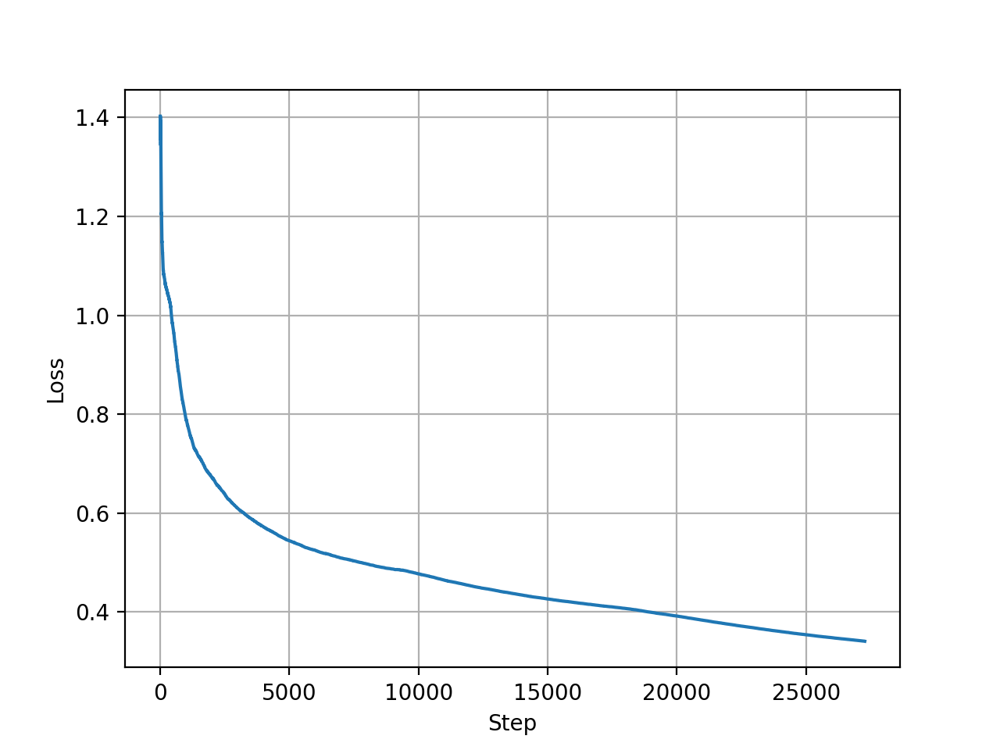

# 11-711 Assignment 3 (Aditya, Pratik, Priyam)

This repository reproduces the results from [Fine-grained Fact Verification with Kernel Graph Attention Network](https://www.aclweb.org/anthology/2020.acl-main.655.pdf), [(original codebase)](https://github.com/thunlp/KernelGAT) on the FEVER 1.0 dataset as part of the Fall 2021 11-711 course at CMU.


The repository is mostly the same (credit to the original KGAT authors for sharing a highly reproducible and accessible codebase under an MIT license). The changes/additions are listed below:
* 

You can refer to the original repository (to access the original code, weights, etc) [here](https://github.com/thunlp/KernelGAT). For more information about the FEVER, please refer to [fever.ai](http://fever.ai).

## Setup and installation
```
git clone https://github.com/priyamtejaswin/KernelGAT.git
cd KernelGAT
conda env create --file env.yml
conda activate kgat-reproduce
pip install torch==1.8.2+cu111 torchvision==0.9.2+cu111 torchaudio==0.8.2 -f https://download.pytorch.org/whl/lts/1.8/torch_lts.html
```

## Data and checkpoints
Download the training data and retrieved evidences from [this link](https://thunlp.oss-cn-qingdao.aliyuncs.com/KernelGAT/FEVER/KernelGAT.zip).
* Unzip, and copy all contents from the unzipped `data` dir to `KernelGAT/data/`.

You can download our fine-tuned KGAT model weights and the original KGAT model weights from [this Google Drive link](https://drive.google.com/file/d/13YKrZfgW6g3GpI_7VKdPOusYxGMgmMv9/view?usp=sharing) (2.4GB total).
Download the the zip file in this directory, and unzip **in this directory**. The structure should be:
```
KernelGAT/
    data/
    kgat/
    checkpoint/
        kgat
    LICENSE
    ...
```

## Reproducing results
Follow these steps to either re-train the KGAT model from scratch, or use the existing checkpoint to generate predictions and compute metrics.

### Re-training
```
cd kgat/
bash train.sh
```
The `train.sh` script can accept different hyperparameters. The complete list is in `kgat/train.py`.

We trained the model for 3 epochs (about 27000 steps) on an Nvidia A6000 GPU. Training took 9 hours in total. The loss curve looks like the following:


### Inference
We provide two weight files (one from our retraining `model.new.best.pt` and the other from the KGAT authors `model.best.pt`).
```
cd kgat/
bash test.sh
```
The `test.sh` script can use different checkpoints. This command will generate the predictions and store in `kgat/output/dev.json`.
**Note that this does not use the GPU and will take upto 30 mins.**

## Results
We provide our predictions in `kgat/output/dev.json`. These can be used to generate the two metrics (**label accuracy** and **FEVER-score**):
```
$ python fever_score_test.py --predicted_labels ./output/dev.json  --predicted_evidence ../data/bert_eval.json --actual ../data/dev_eval.json
+-------------+----------------+--------------------+-----------------+-------------+
| FEVER Score | Label Accuracy | Evidence Precision | Evidence Recall | Evidence F1 |
+-------------+----------------+--------------------+-----------------+-------------+
|    0.7779   |     0.7988     |       0.2729       |      0.9437     |    0.4234   |
+-------------+----------------+--------------------+-----------------+-------------+
```

Here are the results compared agains the scores in the KGAT paper (last line in Table 2)

| Model                     | Label Accuracy | FEVER Score |
|---------------------------|----------------|-------------|
| KGAT SoTA (Roberta-Large) | 78.29          | 76.11       |
| Ours (Roberta-Large)      | 79.88          | 77.79       |


## Credit and citation
Credit to the original authors for sharing their code, data and results. Please cite their original works if you choose to use any part of this, or the original repo.
```
@inproceedings{liu2020kernel,
  title={Fine-grained Fact Verification with Kernel Graph Attention Network},
  author={Liu, Zhenghao and Xiong, Chenyan and Sun, Maosong and Liu, Zhiyuan},
  booktitle={Proceedings of ACL},
  year={2020}
}
```
```
@inproceedings{liu2020adapting,
    title = {Adapting Open Domain Fact Extraction and Verification to COVID-FACT through In-Domain Language Modeling},
    author = {Liu, Zhenghao and Xiong, Chenyan and Dai, Zhuyun and Sun, Si and Sun, Maosong and Liu, Zhiyuan},
    booktitle = {Findings of the Association for Computational Linguistics: EMNLP 2020},
   year={2020}
}
```
## Contact and issues
Please raise an issue on this repository and one of us will get back to you.
